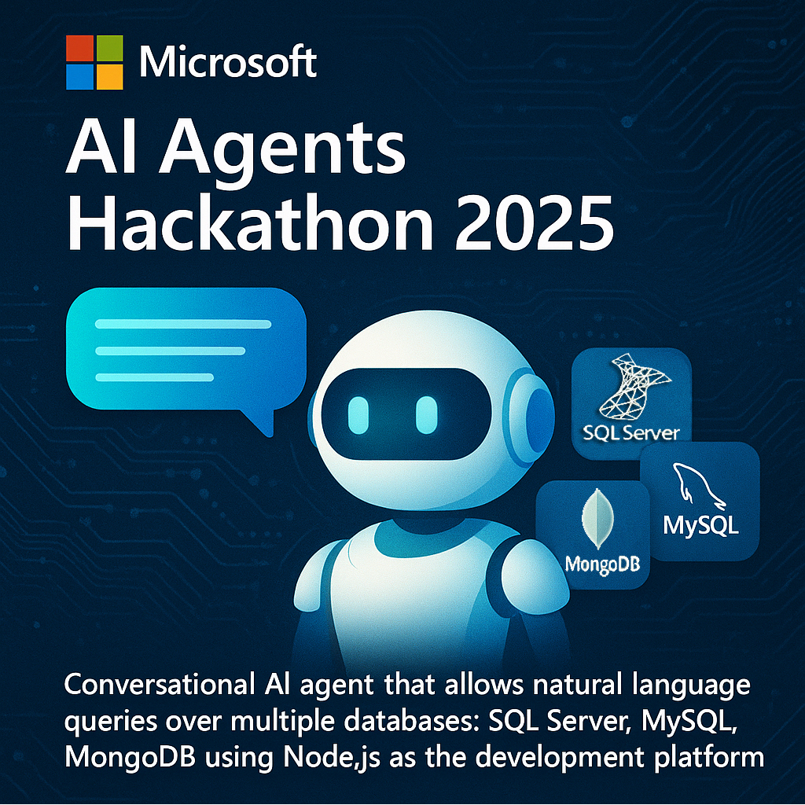

# Agente-Conversacional-para-Consultas-de-Bases-de-Datos-Empresariales

agentes conversacional de inteligencia artificial que permite realizar consultas en lenguaje natural sobre múltiples bases de datos: SQL Server, MySQL y MongoDB usando Node.js 

